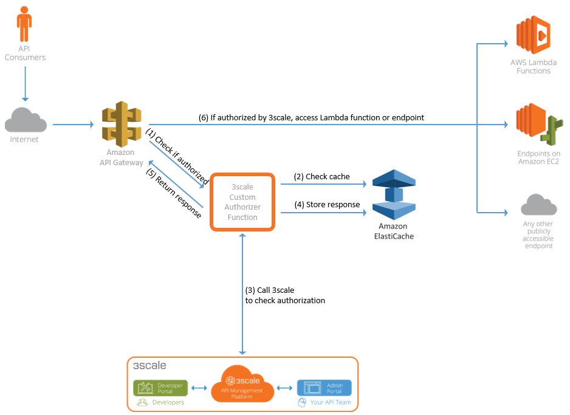
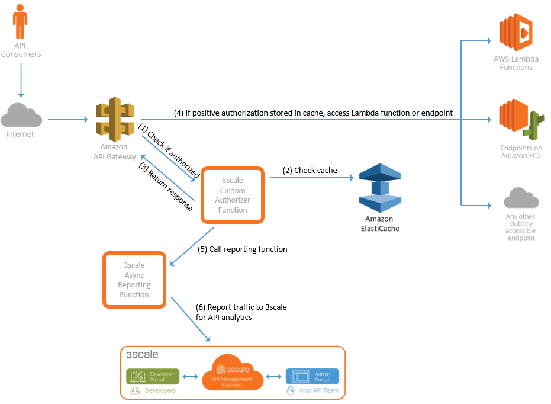
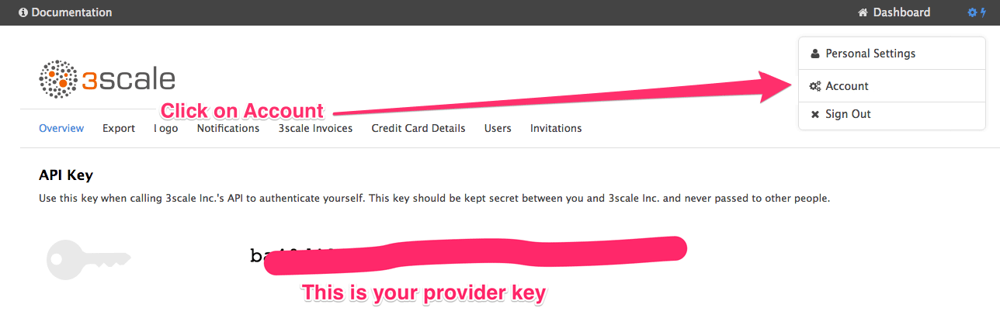
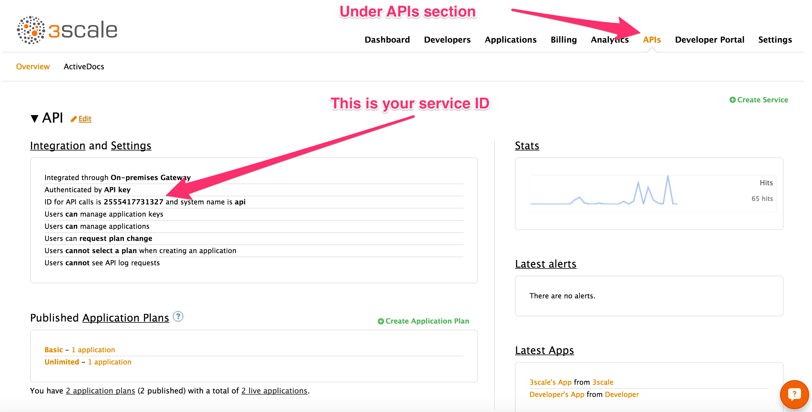
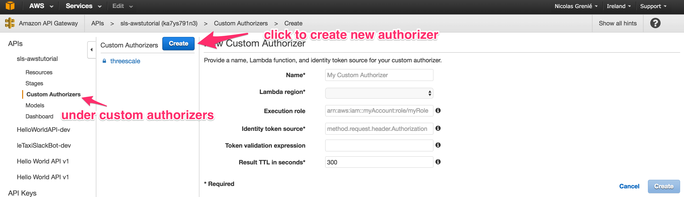
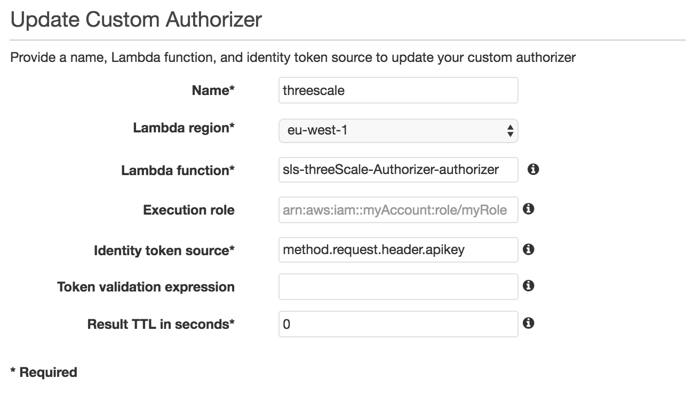
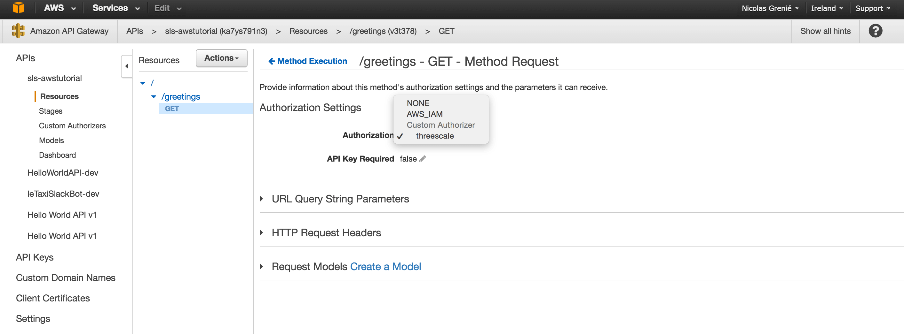
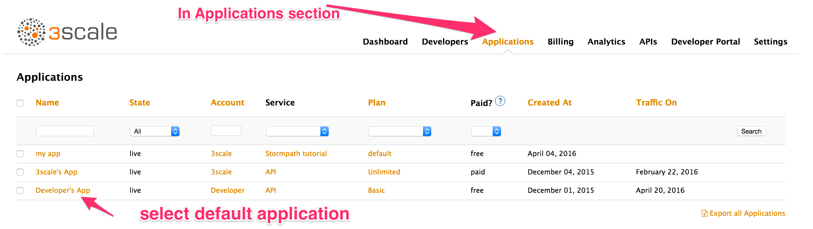
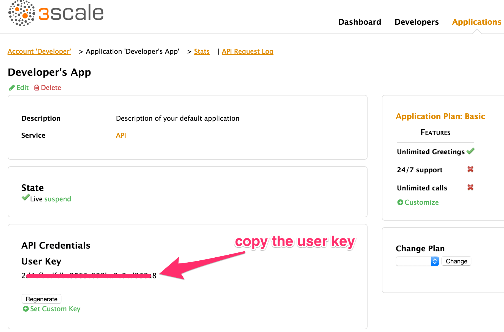
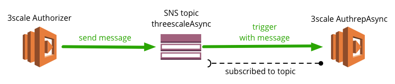

# Run Zero-Infrastructure APIs On Amazon API gateway and 3scale

## Prerequisites for this tutorial

* 3scale account &mdash; sign up at [3scale.net](https://www.3scale.net/signup/)
* AWS account &mdash; sign up at [aws.amazon.com](http://aws.amazon.com)
* AWS command line interface (CLI) installed locally - [Instructions](http://docs.aws.amazon.com/cli/latest/userguide/cli-chap-welcome.html)
* Node.js environment installed locally - [Instructions](https://docs.npmjs.com/getting-started/installing-node)
* Serverless framework installed locally - [Instructions](https://github.com/serverless/serverless)

## Goals

This tutorial will show you how to add an API management layer to your existing API using:

* Amazon API Gateway: for basic API traffic management
* AWS Lambda: for implementing the logic behind your API
* ElastiCache for caching API keys and improving performance
* VPC for connecting AWS Lambda with ElastiCache
* Serverless Framework for making configuration and deployment to Lambda a lot easier
* 3scale API Management Platform for API contracts on tiered application plans, monetization, and developer portal features with interactive API documentation

Below are two overview diagrams that illustrate the components involved and their interactions. The first diagram shows what happens when a certain API endpoint is called for the first time together with a certain API key.



Here is the flow for the first call:

1. Amazon API Gateway checks the 3scale custom authorizer to see whether this call is authorized.
2. The 3scale custom authorizer checks whether the authorization info is stored in the cache.
3. Since it’s the first call, there is no info stored in the cache. So, the 3scale custom authorizer queries the 3scale API Management Platform, which returns whether this call is authorized or not.
4. The 3scale custom authorizer updates the cache accordingly.
5. The 3scale custom authorizer returns the authorization response to the Amazon API Gateway.
6. If the call was positively authorized, the Amazon API Gateway directly queries the API backend, which in this case is a Lambda function.

The second diagram below shows what happens to every subsequent request to the same API endpoint with the same API key.



Here is the flow for every subsequent call:

1. Amazon API Gateway checks with the 3scale custom authorizer to see whether this call is authorized.
2. The 3scale custom authorizer checks whether the authorization info is stored in the cache. Since other calls have previously been executed, the cache has the authorization info stored.
3. The 3scale custom authorizer returns the authorization response to the Amazon API Gateway.
4. If the call was positively authorized, the Amazon API Gateway directly queries the API backend, which in our case is a Lambda function.
5. The 3scale custom authorizer calls the 3scale async reporting function.
6. The 3scale async reporting function reports the traffic back to the 3scale API Management Platform, which is used for API analytics.

## (Optional) Create an API and deploy it to Amazon API Gateway

If you don't yet have an API deployed on Amazon API Gateway, you can create one very easily using [Serverless](https://github.com/serverless/serverless) Framework. ```sls``` is the Serverless CLI, which you should have installed on your system as part of the prerequisites of this tutorial.

Next:

1. Create a new directory ```sls-awstutorial``` (```mkdir sls-awstutorial```)
2. Move into the new directory: <code>cd sls-awstutorial</code>
3. Create a service (```serverless create --template aws-nodejs```)
4. It should have created two files: ```handler.js``` for the logic of the Lambda function, and ```serverless.yml``` for the configuration.
5. Create an endpoint: in ```serverless.yml``` file in ```functions``` section, replace code by following lines:

```
functions:
  hello:
    handler: handler.hello
    events:
     - http:
         path: api/hello
         method: get
```

6. Test the function locally running <code>sls invoke local -f hello</code><br />You should see the following result:

```
{
    "statusCode": 200,
    "body": "{\"message\":\"Go Serverless v1.0! Your function executed successfully!\",\"input\":\"\"}"
}
```

This is what we will returned by our API endpoint.
7. Finally deploy this endpoint using: ```sls deploy```. It will deploy the Lambda function and the API Gateway.

If it succeeded, it should give you the URL of the API created. You will use this API for the rest of the tutorial.

## Deploy stack

For this integration, you’re going to use a lot of different services from the AWS stack. To simplify the deployment and the linking of this stack, you’re going to use CloudFormation.

If you’re not familiar with CloudFormation, it's an AWS service that lets you describe in a JSON file all the AWS services you want to use and link them together. You can read more about CloudFormation [here](http://aws.amazon.com/cloudformation/).

We’ve also bundled the CloudFormation stack into our Serverless project, so the Lambda functions can take advantage of CloudFormation.

The Lambda functions will call the 3scale API Management Platform to check whether calls to the API are authorized.

Serverless Framework is a great way to deploy Lambda functions easily. If you’re not familiar with it, check out their [site](http://serverless.com). It's basically a tool that helps you manage Lambda functions easily.

Follow these steps to deploy the 3scale stack:

1. Clone [this repo](https://github.com/picsoung/awsThreeScale_Authorizer) locally using the following commands:

```
git clone https://github.com/picsoung/awsThreeScale_Authorizer
cd awsThreeScale_Authorizer
```

2. In the ```awsThreeScale_Authorizer``` folder, there are two different files:

* **handler.js** - containing logic of two functions ```authorizer``` and ```authrepAsync```
      
      ```authorizer``` is the Lambda function that is called by the Amazon API Gateway to authorize incoming API calls (see the [first diagram above](#firstcall)).
      ```authrepAsync``` is called by the <code>authorizer</code> function to sync with the 3scale API Management platform for API traffic reporting and analytics (see the <a href="#subsequentcalls">second diagram above</a>).
     
* **serverless.yml** - configuration of Serveless project and Clouformation template

To check the CloudFormation settings you can look at the bottom of ```serverless.yml``` file under ```Resources section```.

Before deploying this to AWS we need to complete a few more tasks.

1. *Install* serverless project dependencies:

```
npm install
```

This will install all the npm modules you need to run the functions.

2. The logic of each Lambda function is kept in the <code>handler.js</code> file, but we don't have to touch it. If you look at the code in this file you will see that we are using environment variables. So, let's set them up:

In the ```serverless.yml``` file modify the placeholder ```YOUR_THREESCALE_PROVIDER_KEY``` and ```YOUR_THREESCALE_SERVICE_ID``` with your own values under ```environment``` section.

```
environment:
   SERVERLESS_REGION: ${self:provider.region}
   THREESCALE_PROVIDER_KEY: "YOUR_THREESCALE_PROVIDER_KEY" #CHANGE IT TO YOUR OWN
   THREESCALE_SERVICE_ID: "YOUR_THREESCALE_SERVICE_ID" #CHANGE IT TO YOUR OWN
   ELASTICACHE_ENDPOINT:
     Fn::GetAtt:
       - elasticCache
       - RedisEndpoint.Address
   ELASTICACHE_PORT: 6379
   SNS_TOPIC_ARN:
     Ref: SNStopic
```

You can find ```YOUR_THREESCALE_PROVIDER_KEY``` under *Accounts* tab in your 3scale Admin Portal.



You can find ```YOUR_THREESCALE_SERVICE_ID``` under the ```APIs``` tab.



You don't need to change anything else in this file. Serverless and CloudFormation will populate the other environment variables.

3. Finally, deploy your function and resources:

```sls deploy```

This command may take a while as it's deploying all the AWS services. At the end of the output you will see the names of the deployed resources.

If everything went well, you are done with the coding part. You are ready to use 3scale on your API.

## Add 3scale custom authorizer to Amazon API Gateway

You are now going to add the custom authorizer functions you just deployed to your existing API on the Amazon API Gateway.

To do so follow these steps:

1. Go to the Amazon API Gateway console and select your API.
2. You should see a section named ```Custom Authorizers``` in the menu on the left hand side. Click on it.
3. Click on the ```Create``` button to create your custom authorizer.
4. Name it ```threescale```.



5. Choose the region where your Lambda has been deployed
6. For the ```Lambda function``` field, look for and choose the authorizer function you have deployed earlier. (Just start typing and it should appear: ```ThreeScale-authorizer```.)
7. Under ```Identify token source``` modify it to ```method.request.header.apikey```. It means that we are expecting developers to make a call to our API with a header ```apikey```, and we will use this key to authenticate the request.
8. Finally change TTL to 0.



We now have a custom authorizer, which is already handling caching.

Finally, we have to apply it to our API endpoints:

1. Go to the ```Resources``` part of your API.
2. Select a method, and click on the ```method request``` box.
3. Change ```Authorization``` to the ```threescale``` custom authorizer you have created before and save.



4. Finally, re-deploy your API by clicking on the <code>Actions</code> button and then select <code>Deploy API</code> at the bottom.

You would have to reproduce these steps on each endpoint of your API to make sure your entire API is secured. But for now, you can limit it to a single endpoint.

## Testing the whole flow end-to-end

You are almost done!

Test to see whether everything worked:

1. Go to your 3scale Admin Portal.
2. Take a valid API key. Any of them will do. Once you’re logged in to your 3scale account, go to the ```Applications``` section.
3. Click on the default application.



4. On the next screen, you’ll see details about this application such as which plan is associated with it and traffic over the last 30 days. You can look at those features later. For now, you’re only interested in the <code>User Key</code>. Copy it.



Finally, to test the whole API flow end-to-end, including authorization via custom authorizer and 3scale API Management Platform, make a call to your API endpoint and include the API key as a header.

To do that, open a terminal and run the following command (you could also use a client like [Postman](https://www.getpostman.com/):

```
curl -X http://YOUR_API_GATEWAY_URL/YOURENDPOINT \
    -H 'apikey: 3SCALE_API_KEY'
```

If you did everything correctly, you will see the result of your API call returned.

Now try with a non-valid key. Simply replace the API key with any random string. Hit the endpoint again. See? It does not work. The call is not authorized and an error response is returned.

Your API is now protected and only accessible to people with valid API keys.

## Additional resources

### Intro to the Amazon API Gateway custom authorizer principles

With the Amazon API Gateway custom authorizer, you can control access to your APIs using bearer token authentication strategies such as OAuth and SAML. To do so, you provide and configure a custom authorizer (basically your own Lambda function) for the Amazon API Gateway, which is then used to authorize client requests for the configured APIs. You can find all the details about how to do this in a dedicated Amazon API Gateway [tutorial](http://docs.aws.amazon.com/apigateway/latest/developerguide/use-custom-authorizer.html).

### Async mechanism using Amazon Simple Notification Service

The 3scale custom authorizer function will be called every time a request comes into the Amazon API Gateway. It’s inefficient to call the 3scale API Management Platform every time to check whether a certain API key is authorized or not. That's where ElastiCache comes in handy.

You implemented the logic of your custom authorizer such that the first time you see an API key, you will ask 3scale to authorize it. You then store the result in cache, so you can serve it next time the same API key is making another call.

All subsequent calls use the ```authRepAsync``` Lambda function to sync the cache with the 3scale API Management Platform.

This ```authRepAsync``` function is called by the main ```authorizer``` function using the [Amazon Simple Notification Service](https://aws.amazon.com/sns/) (SNS). SNS is a notifications protocol available on AWS. A Lambda function can subscribe to a specific topic. Every time a message related to this topic is sent, the Lambda function is triggered.



